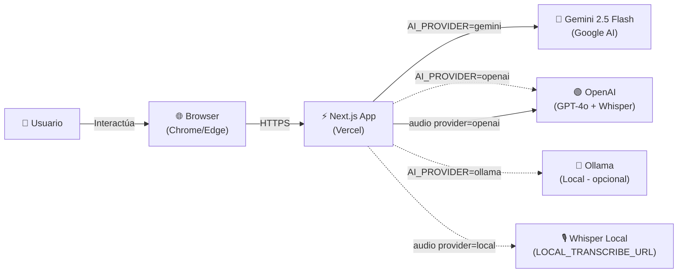

# Diagramas de Componentes (Flowcharts)

Propósito: mapa estable del sistema. Actualizar solo si cambia topología.

## Contexto (alto nivel)

## Componentes principales

```mermaid
flowchart TB
    subgraph Browser["Browser (Client-side)"]
        subgraph UI["UI Layer"]
            Page["page.tsx\n(main orchestrator)"]
            ModeSelector["ModeSelector.tsx\n(video/coding/cert/entrevista)"]
            CaptureControls["CaptureControls.tsx\n(start/stop/status)"]
            AnalysisPanel["AnalysisPanel.tsx\n(results display)"]
            AudioProviderSelector["AudioProviderSelector.tsx\n(openai/local)"]
        end

        subgraph Hooks["Hooks Layer"]
            useScreenCapture["useScreenCapture\n(getDisplayMedia wrapper)"]
            useFrameAnalysis["useFrameAnalysis\n(interval + worker bridge)"]
            useAudioCapture["useAudioCapture\n(MediaRecorder chunks → transcribe)"]
        end

        subgraph Workers["Web Workers"]
            AnalysisWorker["analysisWorker.ts\n(off-thread fetch)"]
        end

        subgraph BrowserAPIs["Browser APIs"]
            DisplayMedia["getDisplayMedia()\n(video + system audio)"]
            CanvasAPI["Canvas API\n(frame extraction)"]
            MediaRecorderAPI["MediaRecorder\n(audio chunks WebM/OGG)"]
            MicAPI["getUserMedia()\n(mic stream)"]
        end
    end

    subgraph Server["Server-side (Next.js API Routes)"]
        APIAnalyze["POST /api/analyze\n(proxy + key protection)"]
        APITranscribe["POST /api/transcribe\n(audio → text)"]
        APILog["POST /api/log\n(session logging)"]

        subgraph AILib["AI Abstraction (Strategy Pattern)"]
            AIFactory["factory.ts\n(getAIProvider)"]
            GeminiProvider["gemini.ts\n(analyzeScreen + analyzeText\n+ analyzeWithTools)"]
            OpenAIProvider["openai.ts\n(analyzeScreen + analyzeText\n+ analyzeWithTools)"]
            OllamaProvider["ollama.ts\n(analyzeScreen + analyzeText\n+ analyzeWithTools*)"]
        end

        subgraph AudioLib["Audio Abstraction (Strategy Pattern)"]
            AudioFactory["factory.ts\n(getAudioProvider)"]
            OpenAIAudio["openai.ts\n(Whisper API)"]
            LocalAudio["local.ts\n(LOCAL_TRANSCRIBE_URL)"]
        end

        subgraph ToolCalling["Tool Calling (Interview mode)"]
            InterviewPatterns["interview-patterns.ts\n(14 patrones + findPattern)"]
            LookupTool["LOOKUP_PATTERN_TOOL\n(tool definition)"]
        end
    end

    subgraph External["External Services"]
        Gemini["Gemini 2.5 Flash API"]
        OpenAI["OpenAI API\n(GPT-4o + Whisper)"]
        Ollama["Ollama (local)"]
        LocalTranscribe["Local Whisper\n(LOCAL_TRANSCRIBE_URL)"]
    end

    Page --> ModeSelector
    Page --> CaptureControls
    Page --> AnalysisPanel
    Page --> AudioProviderSelector
    Page --> useScreenCapture
    Page --> useFrameAnalysis
    Page --> useAudioCapture

    useScreenCapture --> DisplayMedia
    useFrameAnalysis --> CanvasAPI
    useFrameAnalysis --> AnalysisWorker

    useAudioCapture --> DisplayMedia
    useAudioCapture --> MediaRecorderAPI
    useAudioCapture --> MicAPI
    useAudioCapture -->|"chunks WebM"| APITranscribe
    useAudioCapture -->|"transcript → AI"| APIAnalyze

    AnalysisWorker -->|"fetch POST"| APIAnalyze

    APIAnalyze --> AIFactory
    AIFactory -->|"gemini"| GeminiProvider
    AIFactory -.->|"openai"| OpenAIProvider
    AIFactory -.->|"ollama"| OllamaProvider

    APIAnalyze -->|"entrevista + tools"| LookupTool
    LookupTool --> InterviewPatterns

    GeminiProvider --> Gemini
    OpenAIProvider --> OpenAI
    OllamaProvider -.-> Ollama

    APITranscribe --> AudioFactory
    AudioFactory -->|"openai"| OpenAIAudio
    AudioFactory -.->|"local"| LocalAudio
    OpenAIAudio --> OpenAI
    LocalAudio -.-> LocalTranscribe

    subgraph Constants["Constants / Config"]
        AnalysisConstants["constants/analysis.ts\n(modes, prompts, intervals)"]
        AudioConstants["constants/audio.ts\n(audio providers config)"]
    end

    APIAnalyze --> AnalysisConstants
    ModeSelector --> AnalysisConstants
    AudioProviderSelector --> AudioConstants
```

> \* Ollama `analyzeWithTools` hace fallback a `analyzeText` si el modelo no soporta tool calling (lista: llama3.1, llama3.2, qwen2.5, mistral-nemo, mistral, command-r).
