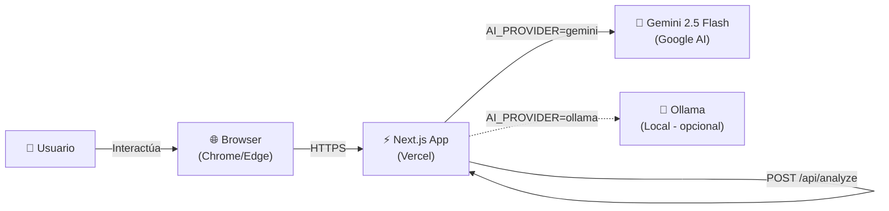
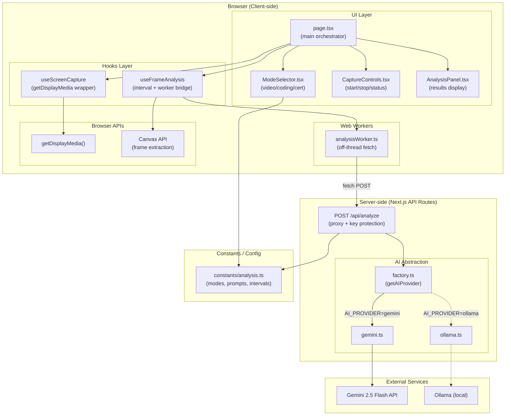

# Diagramas de Componentes (Flowcharts)

Propósito: mapa estable del sistema. Actualizar solo si cambia topología.

## Contexto (alto nivel)

```mermaid
flowchart LR
    Usuario["👤 Usuario"]
    Browser["🌐 Browser\n(Chrome/Edge)"]
    NextApp["⚡ Next.js App\n(Vercel)"]
    GeminiAPI["🤖 Gemini 2.5 Flash\n(Google AI)"]
    OllamaLocal["🦙 Ollama\n(Local - opcional)"]

    Usuario -->|"Interactúa"| Browser
    Browser -->|"HTTPS"| NextApp
    NextApp -->|"POST /api/analyze"| NextApp
    NextApp -->|"AI_PROVIDER=gemini"| GeminiAPI
    NextApp -.->|"AI_PROVIDER=ollama"| OllamaLocal
```

## Componentes principales

```mermaid
flowchart TB
    subgraph Browser["Browser (Client-side)"]
        subgraph UI["UI Layer"]
            Page["page.tsx\n(main orchestrator)"]
            ModeSelector["ModeSelector.tsx\n(video/coding/cert)"]
            CaptureControls["CaptureControls.tsx\n(start/stop/status)"]
            AnalysisPanel["AnalysisPanel.tsx\n(results display)"]
        end

        subgraph Hooks["Hooks Layer"]
            useScreenCapture["useScreenCapture\n(getDisplayMedia wrapper)"]
            useFrameAnalysis["useFrameAnalysis\n(interval + worker bridge)"]
        end

        subgraph Workers["Web Workers"]
            AnalysisWorker["analysisWorker.ts\n(off-thread fetch)"]
        end

        subgraph BrowserAPIs["Browser APIs"]
            DisplayMedia["getDisplayMedia()"]
            CanvasAPI["Canvas API\n(frame extraction)"]
        end
    end

    subgraph Server["Server-side (Next.js API Routes)"]
        APIRoute["POST /api/analyze\n(proxy + key protection)"]

        subgraph AILib["AI Abstraction"]
            Factory["factory.ts\n(getAIProvider)"]
            GeminiProvider["gemini.ts"]
            OllamaProvider["ollama.ts"]
        end
    end

    subgraph External["External Services"]
        Gemini["Gemini 2.5 Flash API"]
        Ollama["Ollama (local)"]
    end

    Page --> ModeSelector
    Page --> CaptureControls
    Page --> AnalysisPanel
    Page --> useScreenCapture
    Page --> useFrameAnalysis

    useScreenCapture --> DisplayMedia
    useFrameAnalysis --> CanvasAPI
    useFrameAnalysis --> AnalysisWorker

    AnalysisWorker -->|"fetch POST"| APIRoute
    APIRoute --> Factory
    Factory -->|"AI_PROVIDER=gemini"| GeminiProvider
    Factory -.->|"AI_PROVIDER=ollama"| OllamaProvider
    GeminiProvider --> Gemini
    OllamaProvider -.-> Ollama

    subgraph Constants["Constants / Config"]
        AnalysisConstants["constants/analysis.ts\n(modes, prompts, intervals)"]
    end

    APIRoute --> AnalysisConstants
    ModeSelector --> AnalysisConstants
```
