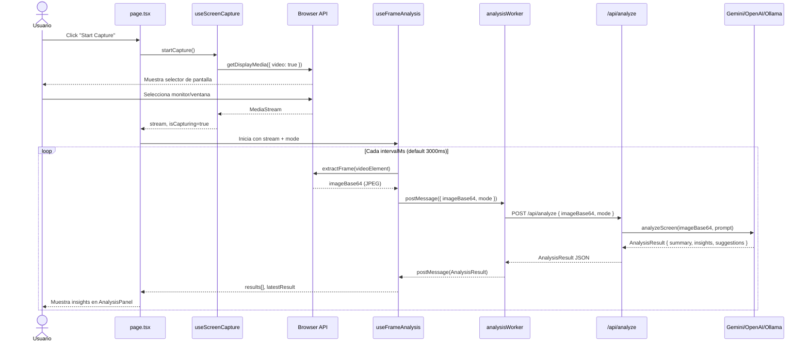
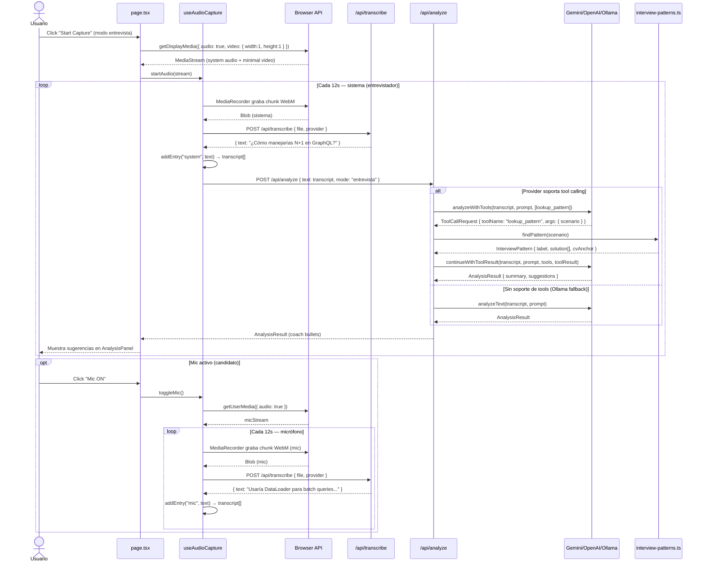
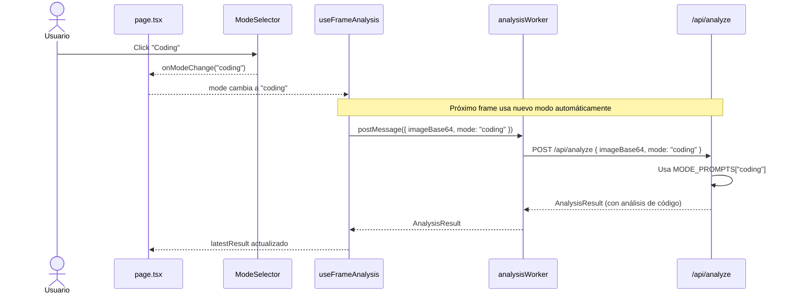
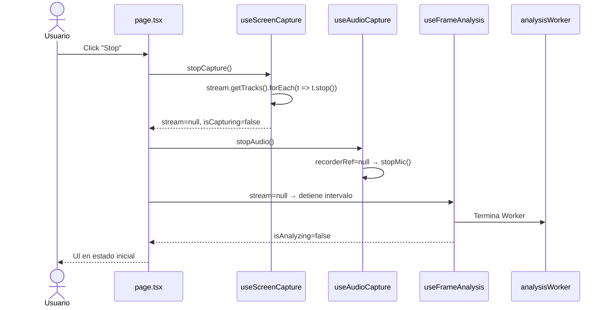
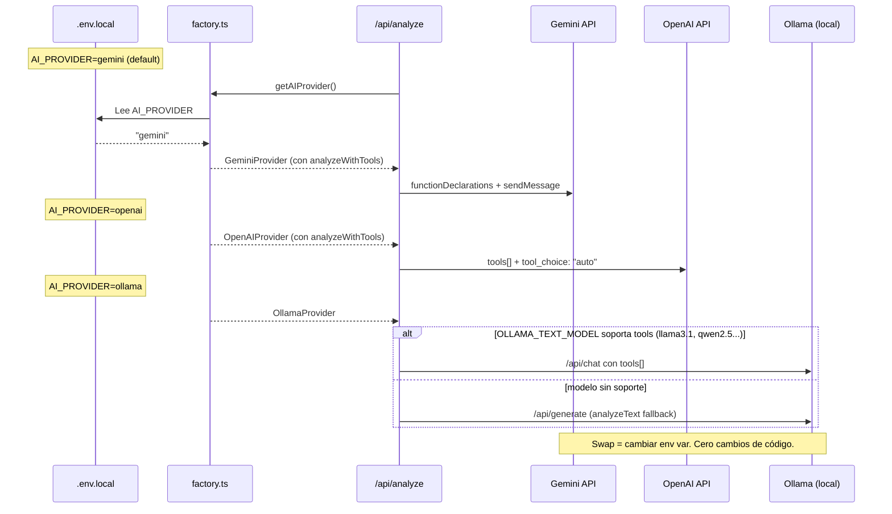

# Diagramas de Secuencia

Propósito: contratos críticos de interacción. Actualizar solo si cambia el flujo de negocio.

## Flujo 1: Iniciar captura y primer análisis (modos video/coding/certification)

## Flujo 2: Modo entrevista — audio + tool calling

## Flujo 3: Cambio de modo durante captura activa

## Flujo 4: Detener captura

## Flujo 5: Swap de AI provider

