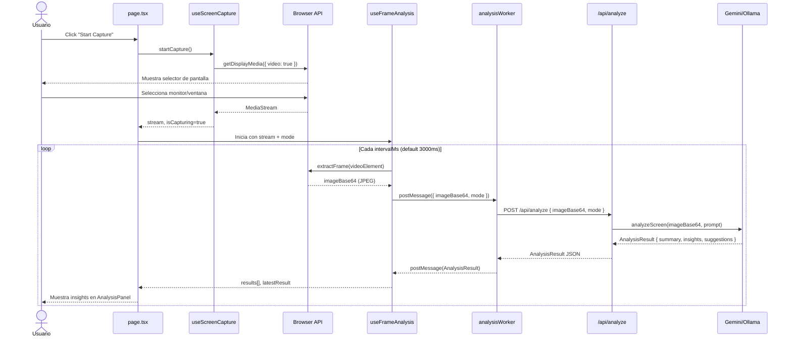
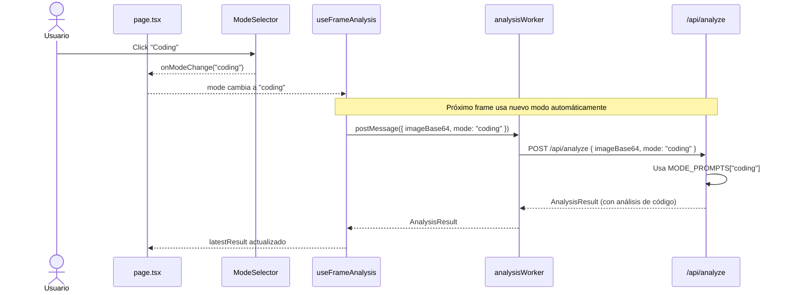
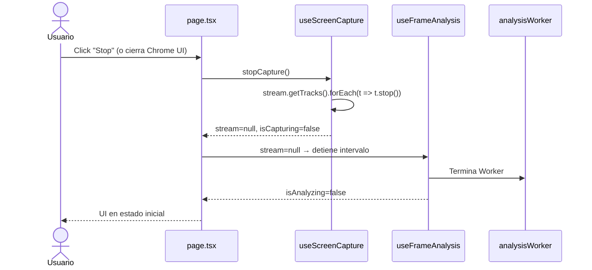
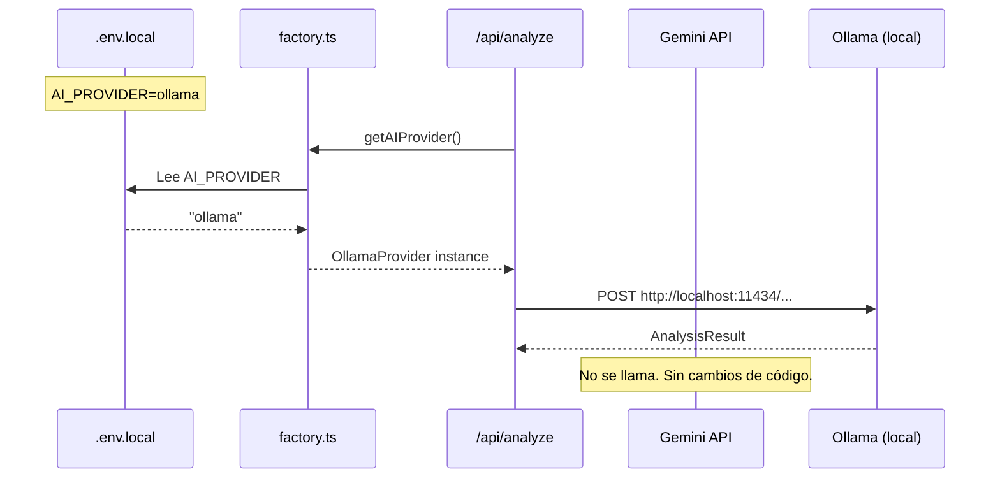

# Diagramas de Secuencia

Propósito: contratos críticos de interacción. Actualizar solo si cambia el flujo de negocio.

## Flujo 1: Iniciar captura y primer análisis

## Flujo 2: Cambio de modo durante captura activa

## Flujo 3: Detener captura

## Flujo 4: Swap de provider (Gemini → Ollama)

